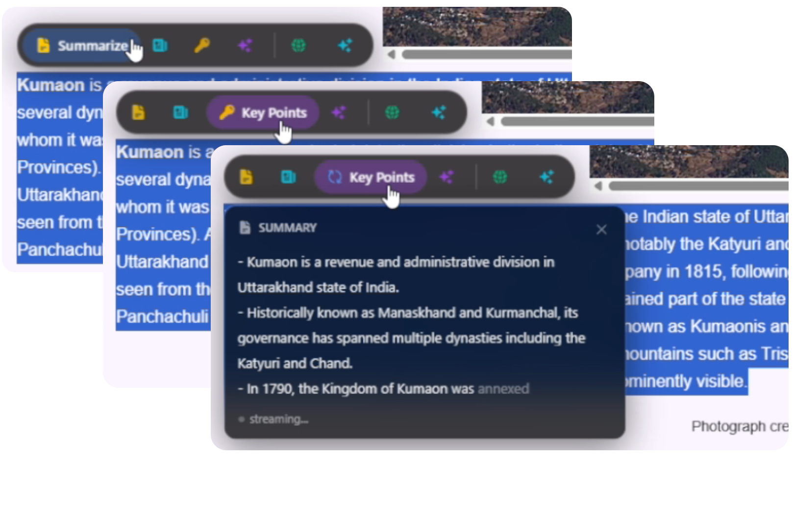
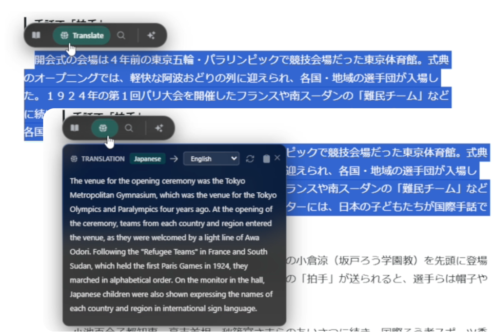
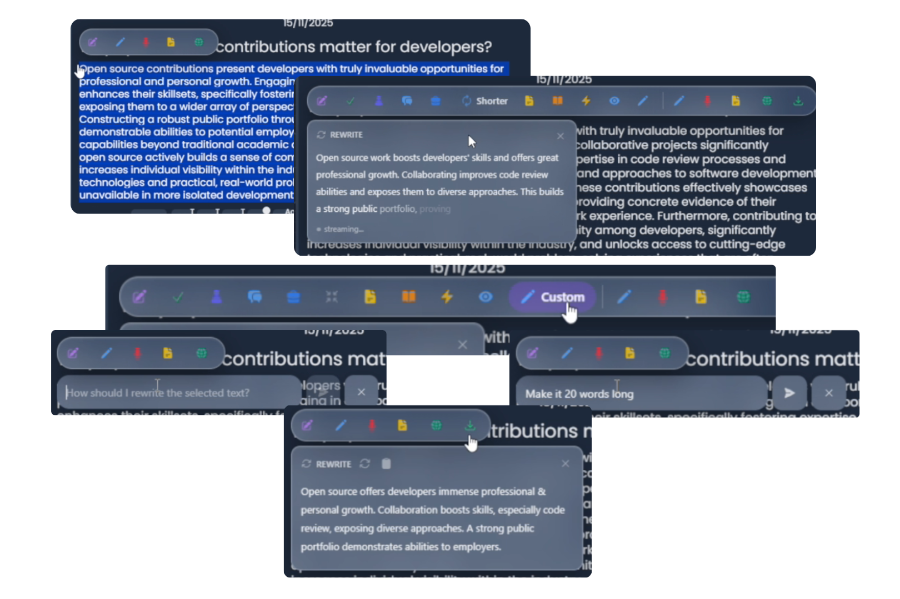
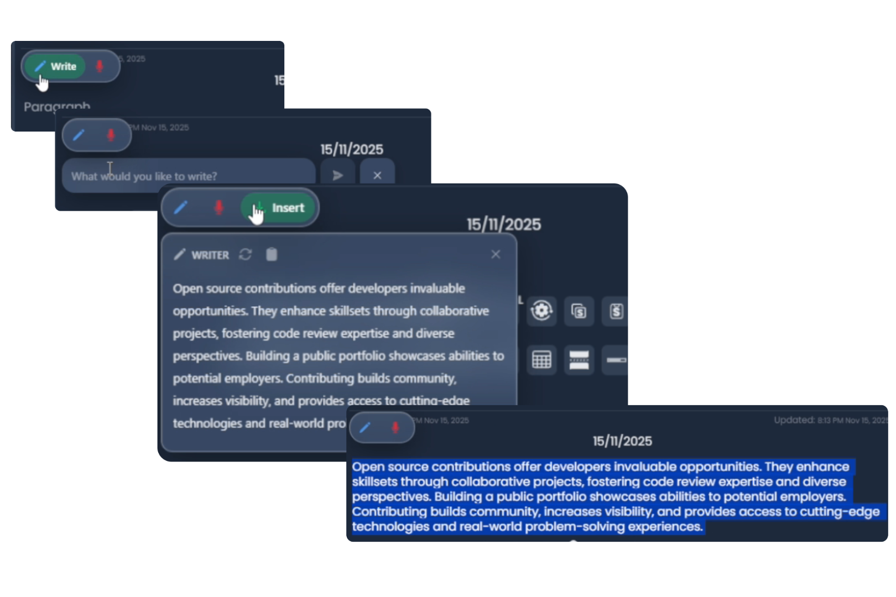

<div align="center">
  
  <h1>VAssist</h1>
  <p>Chrome extension with AI toolbar, chat interface, and animated virtual companion. Runs locally using Chrome's built-in AI.</p>
</div>

<div align="center">

[🎮 Try Demo](https://vassist-demo.vercel.app) • [📖 Documentation](https://b1ink0.github.io/vassist/docs/intro) • [🚀 Installation](#installation) • [💻 Contributing](CONTRIBUTING.md)

</div>

## Overview

<div align="center">
  
</div>

VAssist has three main components:

- **AI Toolbar** - Appears when selecting text or focusing inputs. Provides summarize, translate, rewrite, grammar fix, tone change, image analysis, dictation
- **Chat Interface** - Chat with AI about current page or anything else. Supports image/audio attachments, voice mode, conversation history with branching
- **Virtual Companion** - Animated character that appears on pages. Shows different states (idle, thinking, speaking) with lip-synced speech

Works on Chrome 138+ with built-in AI enabled. All processing happens on device. No external API calls unless you configure third-party providers.

[View full documentation →](https://b1ink0.github.io/vassist/docs/intro)

## Features

### AI Toolbar

<div align="center">
  
</div>

Select any text on any website and a sleek toolbar pops up with powerful AI tools at your fingertips:

---

**📝 Summarize**  

<div align="center">
  
</div>

Turn walls of text into digestible chunks. Uses Chrome's Summarizer API to give you:
- Headline - One punchy line
- Key Points - Bullet list of main ideas  
- Teaser - Short preview that hooks you in

---

**🌍 Translate**  

<div align="center">
  
</div>

Speak the language, any language. Powered by Chrome's Translator API and Language Detector API:
- Translate to 100+ languages instantly
- Auto-detect what language you're reading
- Works completely offline

---

**✍️ Rewrite**  

<div align="center">
  
</div>

Make your words shine. Chrome's Rewriter API helps you:
- Fix Spelling & Grammar - Clean up mistakes
- Change Tone - Go formal, casual, or professional
- Adjust Length - Make it shorter, expand it, or keep it concise
- Improve Clarity - Simplify complex sentences
- Custom Rewrites - Tell it exactly what you want

---

**📚 Dictionary**  
Your personal word expert. Uses Chrome's Prompt API (Gemini Nano):
- Get definitions on the spot
- Find synonyms and antonyms
- Learn pronunciation
- See real usage examples

---

**🎨 Writer**  

<div align="center">
  
</div>

Generate fresh content from scratch. Powered by Chrome's Writer API:
- Create content based on your ideas
- Works with your selected text as context
- Perfect for brainstorming and drafting

---

**🖼️ Image Tools**  
Just hover over any image to:
- Describe - AI tells you what's in the image (Multimodal Prompt API)
- Extract Text - Pull out text from screenshots (OCR)
- Identify Objects - Spot and label things in photos

---

**🎤 Voice Dictation**  

<div align="center">
  
</div>

Talk instead of type. Multimodal Input API lets you dictate directly into text fields.

---

**📄 Document Interaction**  
Work smarter with web content:
- Page Context - Ask questions about the current page you're viewing
- Smart Summaries - Get instant summaries of articles and documents
- Content Analysis - Understand complex content with AI assistance
- Works seamlessly with Chrome's built-in AI

---

### Chat Interface

<div align="center">
  
</div>

Open the chat window anytime to have natural conversations with Gemini Nano running right in your browser.

- Page Context - Ask questions about the current page you're viewing
- File Attachments - Drag and drop images or audio files for context
- Voice Mode - Hands-free conversation with TTS and STT
- Chat History - Auto-saved conversations with search and branching
- Message Actions - Edit messages, regenerate responses, TTS playback
- Smooth Animations - Words fade in smoothly one at a time as AI responds
- Temporary Chats - Start sessions that don't save to history

---

### Virtual Companion

<div align="center">
  
</div>

A fully animated character appears on your screen, making the experience more interactive and fun. The character responds with expressions and gestures, bringing some personality to your browsing.

- Display Modes - Full body or portrait mode
- Animations - Idle movements, thinking states, lip-synced speech
- Positioning - Drag anywhere on screen, position saved per preset

## Installation

### Requirements

- Chrome Browser version 138 or newer
- Chrome AI flags enabled (see below)

### Quick Start

**Step 1: Check Chrome Version**

Open `chrome://version` and verify you have version 138+. Update at `chrome://settings/help` if needed.

**Step 2: Enable Chrome AI Flags**

Visit each URL and set to the specified value:

| Chrome Flag URL | Setting |
|-----------------|---------|
| `chrome://flags/#optimization-guide-on-device-model` | **Enabled BypassPerfRequirement** |
| `chrome://flags/#prompt-api-for-gemini-nano` | **Enabled** |
| `chrome://flags/#prompt-api-for-gemini-nano-multimodal-input` | **Enabled** |
| `chrome://flags/#writer-api-for-gemini-nano` | **Enabled** |
| `chrome://flags/#rewriter-api-for-gemini-nano` | **Enabled** |
| `chrome://flags/#summarization-api-for-gemini-nano` | **Enabled** |
| `chrome://flags/#translation-api` | **Enabled** |
| `chrome://flags/#language-detection-api` | **Enabled** |

Click **Relaunch** after enabling all flags.

**Step 3: Install Extension**

1. Download `vassist-extension.zip` from [releases](https://github.com/b1ink0/vassist/releases)
2. Extract the zip file
3. Open `chrome://extensions`
4. Enable **Developer mode** (top-right toggle)
5. Click **Load unpacked**
6. Select the extracted folder

**Step 4: First Launch**

Click the extension icon to run the setup wizard.

[Detailed installation guide →](https://b1ink0.github.io/vassist/docs/installation)

## Contributing

See [CONTRIBUTING.md](CONTRIBUTING.md) for development setup and guidelines.

```bash
git clone https://github.com/b1ink0/vassist.git
cd vassist
bun install

bun run dev                    # Start demo site
bun run build:extension        # Build extension
bun run build:extension:zip    # Create distributable
```

## Built With

- **React** - UI framework
- **Vite** - Build tool
- **Babylon.js** - Character rendering and animation
- **Tailwind CSS** - Styling
- **Dexie.js** - IndexedDB wrapper
- **Kokoro.js** - On-device TTS
- **Chrome AI APIs** - Gemini Nano

## License

MIT License - see [LICENSE](LICENSE) file for details.

## Links

[🐛 Issues](https://github.com/b1ink0/vassist/issues) • [💬 Discussions](https://github.com/b1ink0/vassist/discussions) • [📖 Docs](https://b1ink0.github.io/vassist/docs/intro)

---
