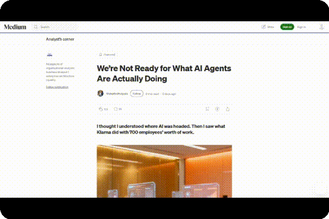

<div align="center">
  
  <h1>VAssist</h1>
  <p>Cross-platform AI assistant for the browser, desktop, and Android, with full chat, on-page tools, voice, and a live companion.</p>
</div>

<div align="center">

[Try Demo](https://vassist-demo.vercel.app) • [Documentation](https://b1ink0.github.io/vassist/intro) • [Releases](https://github.com/b1ink0/vassist/releases)

</div>

## What VAssist Is

<div align="center">
  
</div>

VAssist combines three ways of working in one product:

- **Full chat** for longer conversations, attachments, voice conversation, saved chats, and alternate replies
- **AI toolbar** for rewrite, summarize, translate, dictation, writing, and image tools directly on the current page
- **Virtual companion** for the live avatar, PMX or BPMX assets, VMD or BVMD motions, emotes, and Android wallpaper mode

Setup and settings let you mix local and remote providers, so chat, speech input, and speech output do not have to come from the same backend.

[Open the docs →](https://b1ink0.github.io/vassist/intro)

## Choose a Version

| Version | Best for | Highlights |
| --- | --- | --- |
| Desktop app | People who want the deepest local setup | Local GGUF models, GPT-SoVITS, Faster Whisper, camera, screen share, tray access |
| Android app | People who want VAssist on a phone or tablet | Android-local AI, live wallpaper mode, shared app and wallpaper settings |
| Browser extension | People who want VAssist inside normal websites | In-page toolbar, page-aware chat, Chrome AI support where available |

## AI and Voice Options

| Capability | Local options | Remote or hosted options |
| --- | --- | --- |
| Chat and main AI | Desktop Local with node-llama-cpp and llama.cpp, Android Local with native llama.cpp, Chrome AI in supported browsers | OpenAI, Ollama, OpenAI-compatible servers |
| Speech output | Kokoro.js, Android Local VITS, Desktop Local GPT-SoVITS | GPT-SoVITS remote, OpenAI TTS, OpenAI-compatible TTS |
| Speech input | Android Local Whisper, Desktop Local Faster Whisper, Chrome AI speech input | OpenAI Whisper, OpenAI-compatible STT |

The [AI and Media Stack guide](https://b1ink0.github.io/vassist/architecture/ai-and-media-stack) covers the engine and file-format details behind those options, including GGUF, mmproj, PMX, VMD, Kokoro, GPT-SoVITS, and VITS.

## Installation

For normal use, install from [GitHub Releases](https://github.com/b1ink0/vassist/releases):

1. Desktop app: download the installer for your OS.
2. Android app: download the APK and install it on your device.
3. Browser extension: download `vassist-extension.zip`, extract it, and load it as an unpacked extension in Chrome.

[Detailed installation guide →](https://b1ink0.github.io/vassist/getting-started/installation)

## Learn the App

- [Start Here](https://b1ink0.github.io/vassist/intro) for the recommended reading order
- [Setup Wizard](https://b1ink0.github.io/vassist/getting-started/setup-wizard) for the first-run choices
- [Use VAssist](https://b1ink0.github.io/vassist/guide/) for chat, toolbar, capture, and companion guides
- [Platform Guides](https://b1ink0.github.io/vassist/platforms/desktop) for desktop, Android, and extension differences
- [AI and Media Stack](https://b1ink0.github.io/vassist/architecture/ai-and-media-stack) for the deeper engine and file-format reference

## Build From Source

Source builds are mainly for contributors and custom deployments.

### Requirements

- Bun (recommended) or Node.js
- Chrome for the extension runtime
- Android Studio plus the Android SDK for Android builds

1. Clone the repository and install dependencies:

```bash
git clone https://github.com/b1ink0/vassist.git
cd vassist
bun install
```

2. Choose the runtime you want to run:

- Extension: `bun run dev:extension` (or build zip with `bun run build:extension:zip`)
- Desktop app: `bun run dev:desktop` (or production build with `bun run build:desktop:production`)
- Android app: `bun run dev:android` (or production build with `bun run build:android`)

## Contributing

See [CONTRIBUTING.md](CONTRIBUTING.md) for development setup and guidelines.

## Main Technologies

- **React** - UI framework
- **Vite** - Build tool
- **Electron** - Desktop runtime
- **Capacitor (Android)** - Android runtime bridge
- **Babylon.js** - Character rendering and animation
- **babylon-mmd** - PMX/VMD companion pipeline
- **Dexie.js** - IndexedDB wrapper
- **Kokoro.js** - On-device TTS
- **node-llama-cpp** - Desktop local LLM integration
- **llama.cpp** - Android local LLM backend (native)
- **Express + NanoHTTPD** - Local OpenAI-style API servers
- **Whisper + VITS integrations** - Local STT/TTS service backends
- **Chrome AI APIs** - Native on-device AI integration

## License

GPL-3.0 License - see [LICENSE](LICENSE) file for details.

## Links

[🐛 Issues](https://github.com/b1ink0/vassist/issues) • [💬 Discussions](https://github.com/b1ink0/vassist/discussions) • [📖 Docs](https://b1ink0.github.io/vassist/intro)
