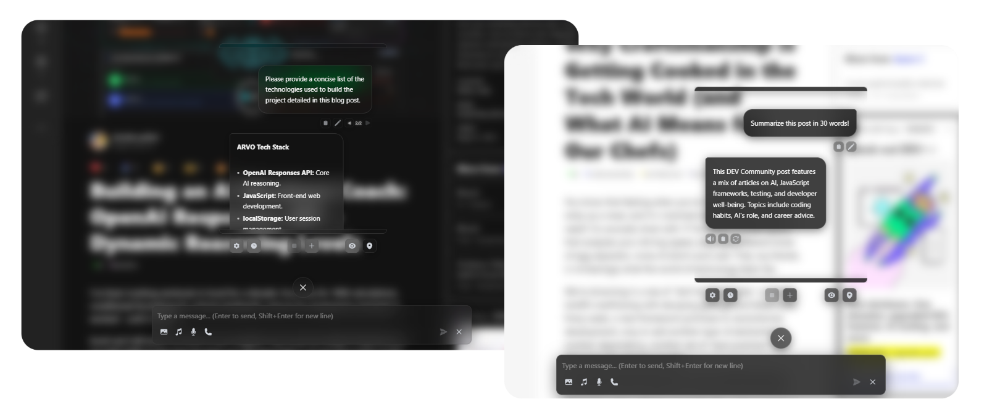
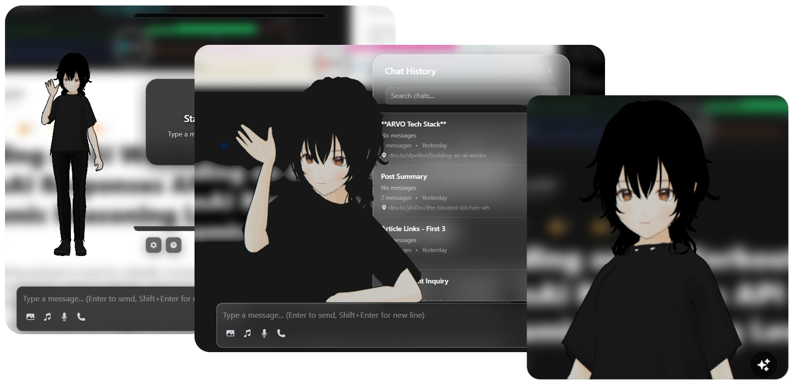
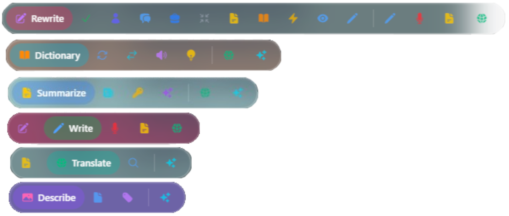

<div align="center">
  
  <h1>VAssist</h1>
  <p>Chat, page tools, and a Live Assistant for the browser, desktop, and Android.</p>
</div>

<div align="center">

[Live Demo](https://vassist-demo.vercel.app) • [Documentation](https://b1ink0.github.io/vassist/intro) • [Installation](#installation)

</div>

## What VAssist Does

<div align="center">
  
</div>

- Full chat for longer conversations, saved threads, attachments, alternate replies, and voice.
- On-page tools for rewrite, summarize, translate, dictation, writing, and image actions without leaving the page.
- Live Assistant that stays on screen, speaks, and works with your own MMD assets.

You can mix providers across chat, speech input, and speech output, so you are not locked into one setup.

[View the full documentation ->](https://b1ink0.github.io/vassist/intro)

### Full Chat

<div align="center">
  
</div>

The main chat view handles streaming replies, page context, attachments, voice mode, and history branching.

### Live Assistant

<div align="center">
  
</div>

Keep the assistant visible while you work, swap models or stages on the fly, and reuse the same avatar as an Android live wallpaper.

### AI Toolbar

<div align="center">
  
</div>

Select text or focus an input to rewrite, summarize, translate, dictate, or run image actions in place.

## Choose a Version

| Version           | Best if you want                         | What you get                                                                                                                       |
| ----------------- | ---------------------------------------- | ---------------------------------------------------------------------------------------------------------------------------------- |
| Desktop app       | Everything in one desktop app            | On-device LLM support, on-device speech input, on-device speech output, camera and screen share, and tray integration              |
| Android app       | VAssist on a phone or tablet             | On-device LLM support, on-device speech input, on-device speech output, shared app and wallpaper settings, and live wallpaper mode |
| Browser extension | VAssist inside the sites you already use | Page-aware chat, on-page tools, and Chrome AI support where available                                                              |
| npm packages      | Embed VAssist in your own web app        | `@vassist/react` for React hosts and `@vassist/embed` for plain JavaScript host bridge for your own AI/TTS/STT backend             |

## Embed in Your Own App

VAssist ships as `@vassist/react` and `@vassist/embed` npm packages. Mount the full assistant into any React or JavaScript host, route AI, TTS, and STT requests through your own backend via the host bridge, and control which features, settings, and UI surfaces are available to users.

[Package integration docs →](https://b1ink0.github.io/vassist/architecture/packages-and-integration)

## Model and Voice Support

| Capability       | On-device or built-in options                                                                                                                                                   | Remote or hosted options                                 |
| ---------------- | ------------------------------------------------------------------------------------------------------------------------------------------------------------------------------- | -------------------------------------------------------- |
| Chat and main AI | Desktop app: GGUF models through `node-llama-cpp` on top of `llama.cpp`. Android app: GGUF models through native `llama.cpp`. Browser and extension: Chrome AI where available. | OpenAI, Ollama, and OpenAI-compatible servers            |
| Speech output    | Browser, extension, and desktop: `kokoro-js`. Desktop app: GPT-SoVITS. Android app: sherpa-onnx VITS.                                                                           | GPT-SoVITS Remote, OpenAI TTS, and OpenAI-compatible TTS |
| Speech input     | Desktop app: Faster Whisper. Android app: sherpa-onnx Whisper. Browser and extension: Chrome AI speech input.                                                                   | OpenAI Whisper and OpenAI-compatible STT                 |

The [AI and Media Stack guide](https://b1ink0.github.io/vassist/architecture/ai-and-media-stack) goes deeper on the engines and file formats behind those options.

## Installation

### Install From Releases

Download artifacts from [releases](https://github.com/b1ink0/vassist/releases):

- Desktop App: install the desktop installer package for your OS
- Android App: install the APK on your Android device
- Browser Extension: download `vassist-extension.zip`

<details>
<summary>Extension install (Chrome)</summary>

1. Download `vassist-extension.zip` from [releases](https://github.com/b1ink0/vassist/releases).
2. Extract the zip file.
3. Open `chrome://extensions`.
4. Enable **Developer mode** (top-right toggle).
5. Click **Load unpacked**.
6. Select the extracted folder.

</details>

If you are not sure where to start, use the [installation guide](https://b1ink0.github.io/vassist/getting-started/installation).

### Build From Source

You do not need every runtime installed to work on this repository. Pick the workflow that matches the part of the repo you are changing.

#### Requirements

- Bun (recommended) or Node.js
- Chrome (for extension runtime)
- Android Studio + SDK (for Android build or run)

#### Setup

```bash
git clone https://github.com/b1ink0/vassist.git
cd vassist
bun install
```

#### Common Commands

| Goal                               | Command                 |
| ---------------------------------- | ----------------------- |
| Standalone web app                 | `bun run dev`           |
| Extension watch build              | `bun run dev:extension` |
| Desktop renderer                   | `bun run dev:desktop`   |
| Android web build + Capacitor sync | `bun run dev:android`   |
| Docs site with embedded assistant  | `bun run docs:dev`      |
| Lint                               | `bun run lint`          |
| App typecheck                      | `bun run typecheck:app` |

### Production Builds

- Extension: `bun run build:extension` or `bun run build:extension:zip`
- Desktop: `bun run build:desktop:production`
- Android: `bun run build:android`
- Docs: `bun run docs:build`

## Contributing

See [CONTRIBUTING.md](CONTRIBUTING.md) for development setup and guidelines.

## Stack

- React
- Vite
- Electron
- Capacitor for Android
- Babylon.js and babylon-mmd
- Dexie
- Kokoro.js
- node-llama-cpp
- llama.cpp
- Express and NanoHTTPD
- `@vassist/react` and `@vassist/embed` npm packages

## License

GPL-3.0. See [LICENSE](LICENSE).

## Links

[Issues](https://github.com/b1ink0/vassist/issues) • [Discussions](https://github.com/b1ink0/vassist/discussions) • [Docs](https://b1ink0.github.io/vassist/intro)
